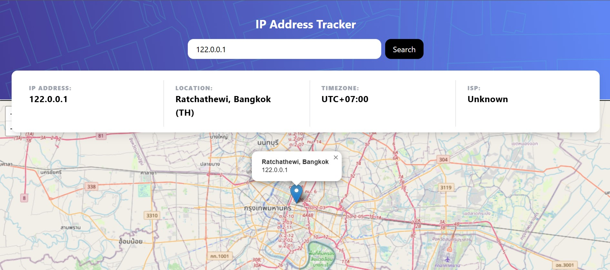

# Frontend Mentor - IP address tracker solution

This is a solution to the [IP address tracker challenge on Frontend Mentor](https://www.frontendmentor.io/challenges/ip-address-tracker-I8-0yYAH0). Frontend Mentor challenges help you improve your coding skills by building realistic projects. 

## Table of contents

- [Overview](#overview)
  - [The challenge](#the-challenge)
  - [Screenshot](#screenshot)
- [My process](#my-process)
  - [Built with](#built-with)
  - [What I learned](#what-i-learned)
  - [Continued development](#continued-development)
  - [Useful resources](#useful-resources)
- [Author](#author)
- [Acknowledgments](#acknowledgments)

## Overview

### The challenge

Users should be able to:

- View the optimal layout for each page depending on their device's screen size
- See hover states for all interactive elements on the page
- See their own IP address on the map on the initial page load
- Search for any IP addresses or domains and see the key information and location

### Screenshot



## My process

### Built with

- Semantic HTML5 markup
- Tailwind CSS - For styling
- [React](https://reactjs.org/) - JS library for building user interfaces
- [Leaflet.js](https://leafletjs.com/) - For rendering interactive maps
- [GeoIP API](https://geo.ipify.org/) - For fetching IP address information

### What I learned

While working on this project, I learned how to integrate an interactive map into a React application using Leaflet.js. I also gained experience handling external APIs and displaying the fetched data dynamically on the page. Additionally, I improved my skills in managing states with React hooks and building a responsive layout using Tailwind CSS.

For instance, here's how I used React to manage the IP address search:

```js
const handleSearch = async (e) => {
  e.preventDefault();
  const apiKey = config.MY_KEY;
  const url = `https://geo.ipify.org/api/v2/country,city?apiKey=${apiKey}&ipAddress=${search}`;
  try {
    const response = await fetch(url);
    if (!response.ok) throw new Error("Error fetching data");
    const result = await response.json();
    setData(result);
  } catch (err) {
    setError(err.message);
  }
};
```

### Continued development

In the future, I want to explore how to improve the error handling and loading states. Additionally, I would like to optimize the app for performance, especially when handling large datasets.

### Useful resources

- [Leaflet Documentation](https://leafletjs.com/) - This helped me understand how to integrate and customize the map view.
- [React Hooks](https://reactjs.org/docs/hooks-intro.html) - This resource helped me deepen my understanding of React hooks, particularly `useState` and `useEffect`.

## Author

- Website - [Emma Roizot](https://www.emma-roizot.fr)
- Frontend Mentor - [@ashandcompany](https://www.frontendmentor.io/profile/ashandcompany)

## Acknowledgments

A big thank you to Frontend Mentor for providing this challenge and to the React community for their resources. Additionally, thanks to the developers behind Leaflet.js for making mapping so accessible in web development.
